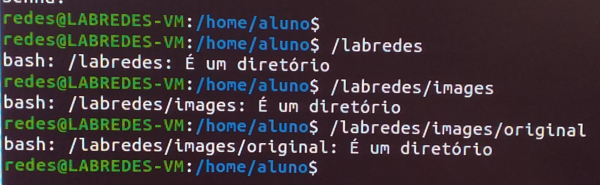
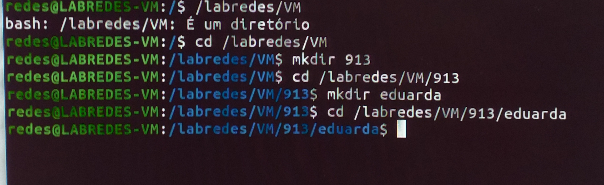

## 1.   No terminal

Para iniciar a etapa 2, é necessário abrir o terminal de sua máquina física. É nele onde serão realizados a maioria dos passos necessários para concluir esta primeira etapa. 

Observação: os passos dessa parte 1 serão os mesmos para os quatro PCs, independente da VM a ser criada. 

### 1.1. Login na rede

Primeiro, é preciso entrar na rede para, assim, conseguirmos efetuar os comandos posteriores. Para isso, vamos executar no terminal o comando: 

``su redes``

Esse comando serve para alterar o usuário que, inicialmente, está configurado como aluno@LABREDES-VM. Após o comando anterior e a inserção da senha (admin@Lab92) para o usuário redes, o usuário foi alterado para redes@LABREDES-VM conforme a figura 1.  

(Por questões de segurança, a senha fica invisível. Então, digite-a corretamente. Caso haja falha na autenticação, basta tentar novamente.)

<p><center> Figura 1: Alteração de usuário aluno para redes</center></p>   
   

### 1.2. Criar pasta labredes na raiz ``/`` e subpastas

Posteriormente criaremos as pastas/os diretórios onde ficarão armazenados nossos arquivos. Mas, antes de criar essas pastas, é importante verificar se elas já existem (tal como ocorre na imagem 2), no caso de não ser a primeira vez configurando uma VM com esses passos.

<p><center> Figura 2: Verificação de existência de pastas e subpastas</center></p>   
   

Para efetuar esta criação dos diretórios, primeiro entra-se no diretório raiz usando:


```shell
cd /
```

Depois, usamos o comando ``mkdir`` prosseguido pelo ``nome do diretório``, mas no caso de ser um usuário comum do sistema, utiliza-se o comando ``sudo`` antes. 


```shell
sudo mkdir /labredes
```

Agora, entramos no diretório labredes para criar as subpastas ``images`` e ``original``:


```shell
cd /labredes
sudo mkdir images
cd images
sudo mkdir original
cd original
```

Agora, entramos novamente no diretório labredes com ``cd /labredes`` para criar os diretórios referentes aos usuários da máquina em questão, faremos isso digitando os comandos: 


```shell
sudo mkdir VM
cd /labredes/VM
sudo mkdir 913 
cd /labredes/VM/913
sudo mkdir <student>
```

Como são 4 PCS com 4 usuários/estudantes distintos, o passo anterior fica da seguinte maneira:


Para terminal do PC1: ```sudo mkdir matheus ```

Para terminal do PC2: ```sudo mkdir ygor ```

Para terminal do PC3: ```sudo mkdir camile ```

Para terminal do PC4: ```sudo mkdir eduarda ```

<p><center> Figura 3: Criação de pasta de usuário 4</center></p>   
   

Agora, antes de passar para a etapa na qual as nossas VMS serão configuradas, primeiro vamos permitir que o usuário aluno possa acessar os arquivos e pastas cujo processo de dowload será descrito na [etapa 2: 2.Configuração da VM](https://github.com/DudaSSilva/grupo2-projeto-2b-sred/blob/main/etapa2-2.NaVM.md).

Para adicionar o aluno ao grupo redes, primeiro efetuamos, no terminal, o comando:

``sudo usermod -aG redes aluno``

Em seguida, modificamos a classificação de pertencimento a grupos utilizando o comando:

``sudo chown -R nobody:nogroup /labredes`` 

E alteramos o proprietário de tal grupo para o usuário aluno com: 

`` sudo chgrp -R redes /labredes`` 

Posteriormente, com o  comando ``sudo chmod -R 771 /labredes`` alteramos as permições de diretórios. Agora, para verificar se está tudo correto para prosseguirmos, sem falhas, com a criação e configuração das VMS, efetuamos o comando `` getent group``, que, basicamente, irá mostrar se o usuário possui grupos e certificará que nossas modificações realizadas com os comandos anteriores funcioram. 

Por fim, a verificação das pastas e subpastas (figura 3) criadas anteriormente é importante para garantir que seus arquivos sejam salvos, e, assim, possamos definir a rota de onde eles estão armmazenados.

<p><center> Figura 4: Verificação de existência de pastas e subpastas</center></p>   
   
