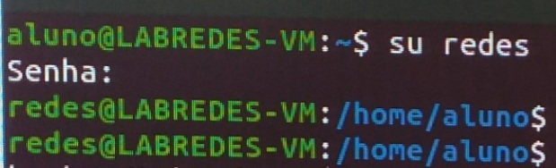

## 2.   Criação e configurações da VM

### 2.1. Baixar arquivos ova e iso

Para iniciar nosso trabalho de configuração das VMS, é preciso fazer o dowload do arquivos``.ova`` ou ``.vdi`` no site do ubuntu.

### 2.2. Criar nova VM e instalar o ubuntu-server-mini

Para o caso de os arquivos ``.iso`` não estarem instalados, precisa-se baixá-los no ubuntu. Vamos, então, abrir o VirtualBox e acessar a opção de Novo/New. Em seguida, setaremos as opções da VM. Feito isso, abrimos a VM e selecionamos a pasta do arquivo iso. É preciso aguardar a VM instalar o sistema operacional para, posteriormente, criarmos o usuário administrador. 

### 2.3. Conseguir/importar a VM

Uma vez que os arquivos foram baixados e a VM fora criada, é preciso abrir o VirtualBox e, conforme a figura 2, acessar a opção de Import_Appliance. Em seguida, selecionamos o arquivo na pasta em que foi baixada.

 Figura 1: Alteração de usuário aluno para redes

   
   
 
Aguarda o carregamento do arquivo e seta as opções da VM.

 Figura 1: Alteração de usuário aluno para redes

   
   
 
Como é necessário duas VMS (para cada PC, claro) para a realização deste projeto, iremos criar uma segunda VM. No entanto, os comandos anteriores não precisam ser repetidos, basta você clonar a VM já criada e apenas alterar as configurações setadas nela para as configurações pré-determinadas para sua segunda VM.

 Figura 1: Alteração de usuário aluno para redes

   
   
    
  
    
### 2.4. Configuração da VM1

