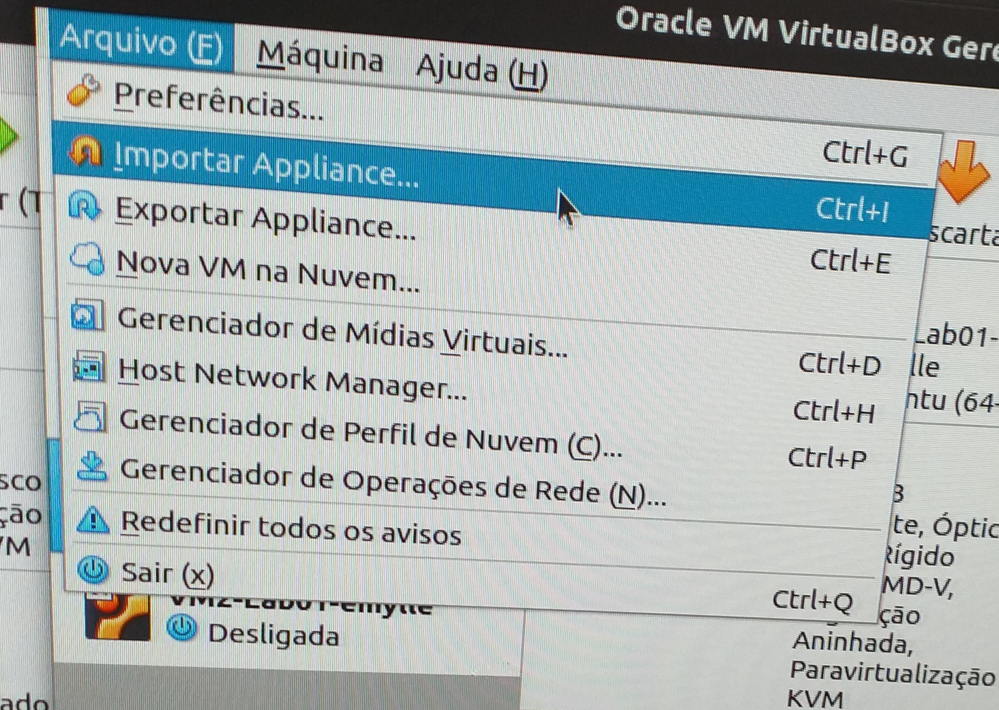
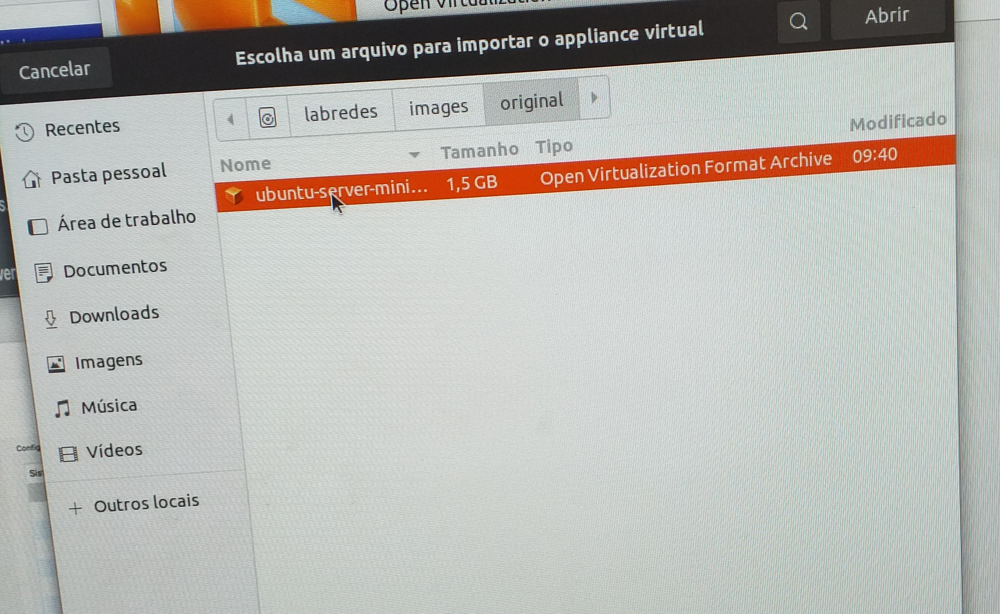
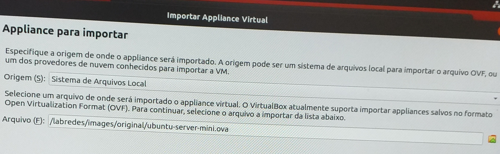
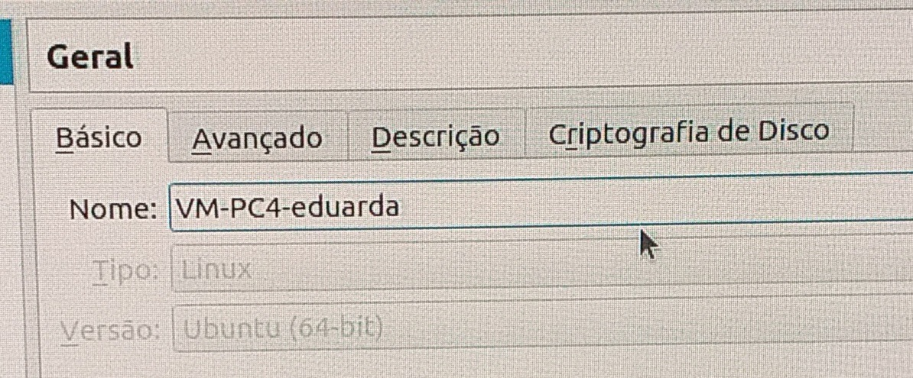
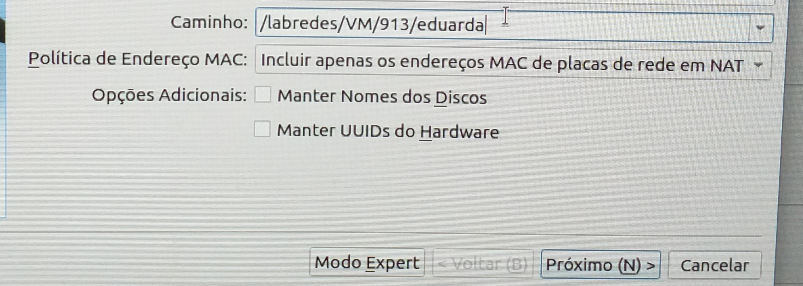

## 2.   Parte 1: Criação da VM

### 2.1. Baixar arquivos ova e iso

Para iniciar nosso trabalho de configuração das VMS, é preciso fazer o dowload do arquivos``.ova`` ou ``.vdi`` no site do ubuntu.

Pelo terminal, isso pode ser feito com o seguinte comando: 

``scp aluno@192.168.101.10:~/Public/iso-images/ubuntu-server-mini.ova /labredes/images/original``

### 2.2. Criar nova VM e instalar o ubuntu-server-mini

Para o caso de os arquivos ``.iso`` não estarem instalados, precisa-se baixá-los no ubuntu. Vamos, então, abrir o VirtualBox e acessar a opção de Novo/New. Em seguida, setaremos as opções da VM. Feito isso, abrimos a VM e selecionamos a pasta do arquivo iso. É preciso aguardar a VM instalar o sistema operacional para, posteriormente, criarmos o usuário administrador. 

(É mportante verificar a existência de tais arquivos, pelo terminal, nas pastas onde foram baixados, com o comando ``ls -la``)

### 2.3. Conseguir/importar a VM

Uma vez que os arquivos foram baixados e a VM fora criada, é preciso abrir o VirtualBox e, conforme a figura 1, acessar a opção de Import_Appliance. Em seguida, selecionamos o arquivo na pasta em que foi baixada. Tal importação é demonstrada na imagem abaixo.

 Figura 1: Importar Appliance.ova

   
   
    
Em seguida, pode-se encontrar o caminho do arquivo a ser importado clicando na caixa amarela ao lado do campo onde a rota do arquivo de ve ser informa e clicar em ``Outos locais > Computador > images > original > e selecionar o arquivo ubuntu`` (figura 2). Outra forma, seria inserir diretamente o arquivo digitando: ``/labredes/images/original/ubuntu-server-mini.ova`` confore domonstrado na figura 3. 

 Figura 2: Importação de arquivo .ova

   
   
    

 Figura 3: Importação manual de arquivo .ova

   
   
 
Aguarda o carregamento do arquivo e seta as opções da VM, modificando, também, a pasta padrão para a máquina seguindo o exemplo: ``/labredes/VM/turma/aluno`` e o nome da VM para o padrão ``VM-PC..-aluno``.

Utilizando a exemplo a VM1-PC4 desta equipe, o passo anterior ficaria da seguinte maneira(ver imagens x e y): 

 Figura 4: Alteração de nome da VM

   
   

 Figura 5: Alteração de caminho para máquina virtual

   
   
 
Como é necessário duas VMS (para cada PC, claro) para a realização deste projeto, iremos criar uma segunda VM. No entanto, os comandos anteriores não precisam ser repetidos, basta você clonar a VM já criada e apenas alterar as configurações setadas nela para as configurações pré-determinadas para sua segunda VM.

