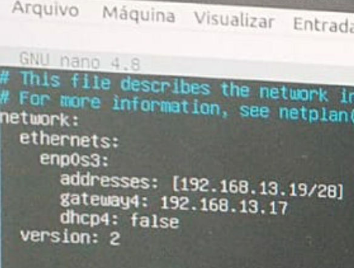

## 2. Parte 2: Configuração das VMS

### 2.1. Configuração das NICs

Antes de iniciar as VMS para realizar o login, altera-se as NICs para o modo ``Rede Interna`` para que, assim, elas possam utilizar a mesma rede cujo nome definido fora ``labredes``.

<p><center> Figura 1: Configuraão das NICs</center></p>   
   

Feito isso, clica duas vezes na VM para iniciá-la ou aperta em ``iniciar``no canto superior do VitualBox.

### 2.2. Login nas VMS

Uma vez iniciadas, faremos login como usuário administrador em todas as VMS, utilizando o usuário ``administrador`` e a senha ``adminifal``.

<p><center> Figura 2: Configuração das NICs</center></p>   
   

Feito o login, nas VMS vamos, antes de mais nada, fazer a instalação das ferramentas de rede que precisaremos para dar prosseguimento com o projeto utilizando o comando: 

``sudo apt install net-tools -y``

<p><center> Figura 3: Instalação de ferramentas</center></p>   
   

Feito isso, efetuamos o comando ``ifconfig -a`` para certificar-nos de que o mesmo fora instalado e esteja funcionando. E utilizando o comando a seguir verificaremos se o arquivo ``yaml``, utilizado pelo ubuntu para configurr interfaces, se encontra instalado.

``cat /etc/netplan/01-netcfg.yaml``

### 2.3. Configuração estática dos endereços IPs na interface da rede
 
Uma vez concluídos os passos anteriores, o próximo é editar o arquivo 01-netcfg.yaml. Para tal, efetuamos o comando ``sudo nano /etc/netplan/01-netcfg.yaml`` e, para cada VM, editamos o arquivo de acordo com as definições de IP feitas na Etapa 1.

A primeira modificação é feita no endereço ip, seguindo o modelo:

``addresses: [192.168.13.xx/28]``

onde x representa os valores específicos de cada VM.

Em seguida,  alteramos o gateway padrão para:

``gateway4: 192.168.13.17`` 

(Observação: estas informações precisam estar dentro do enp0s3 seguindo a identação corretapara evitar erros)

Para salvar, tem-se o atalho ``ctrl+S`` seguidoo de ``ctrl+X``

### 2.3.1. Configuração da VM para PC 1

<p><center> Figura 4: IP VM1-PC1</center></p>   
   

### * Na VM1-PC1

```
network:
    ethernets:
        enp0s3:                              
            addresses: [192.168.13.17/28]    
            gateway4: 192.168.13.17          
            dhcp4: false                     
    version: 2
```

### * Na VM2-PC1

```
network:
    ethernets:
        enp0s3:                              
            addresses: [192.168.13.21/28]    
            gateway4: 192.168.13.17          
            dhcp4: false                     
    version: 2
```

### 2.3.2. Configuração da VM para PC 2

<p><center> Figura 5: IP VM2-PC2</center></p>   
   

### * Na VM1-PC2

```
network:
    ethernets:
        enp0s3:                              
            addresses: [192.168.13.18/28]    
            gateway4: 192.168.13.17          
            dhcp4: false                     
    version: 2
```

### * Na VM2-PC2

```
network:
    ethernets:
        enp0s3:                              
            addresses: [192.168.13.22/28]    
            gateway4: 192.168.13.17          
            dhcp4: false                     
    version: 2
```

### 2.3.2. Configuração da VM para PC 3

<p><center> Figura 6: IP VM1-PC3</center></p>   
   

### * Na VM1-PC3

```
network:
    ethernets:
        enp0s3:                              
            addresses: [192.168.13.19/28]    
            gateway4: 192.168.13.17          
            dhcp4: false                     
    version: 2
```

### * Na VM2-PC3

```
network:
    ethernets:
        enp0s3:                              
            addresses: [192.168.13.23/28]    
            gateway4: 192.168.13.17          
            dhcp4: false                     
    version: 2
```

### 2.3.2. Configuração da VM para PC 4

<p><center> Figura 7: IP VM2-PC4</center></p>   
   

### * Na VM1-PC4

```
network:
    ethernets:
        enp0s3:                              
            addresses: [192.168.13.20/28]    
            gateway4: 192.168.13.17          
            dhcp4: false                     
    version: 2
```

### * Na VM2-PC4

```
network:
    ethernets:
        enp0s3:                              
            addresses: [192.168.13.24/28]    
            gateway4: 192.168.13.17          
            dhcp4: false                     
    version: 2
```

### * Salvar edições

Após salvar previamente com ctrl+S+X, efetuamos, para salvar as novas informações, o comando:

``sudo netplan apply`` 

Novamente, damos ``ifconfig -a`` para verificar se funcionou corretamente e, em seguida, damos ping nas VMs para verificar se a conexão entre elas está funcionando. Há duas maneiras para fazer isso: (i) entre as (duas) VMs de cada PC, sem que haja a necessidade, ainda, do cabo de conexão ou (ii) entre todas as VMs dos quatro PCs, havendo a necessidade da conexão ponto-a-ponto através de um switch.
