## 3. Montando uma rede ponto a ponto física entre quatro PCs e uma LAN lógica com 8 VMs

### 3.1. conecção de cabos via Switch

<p><center> Figura 1: Conecção via switch</center></p>   
   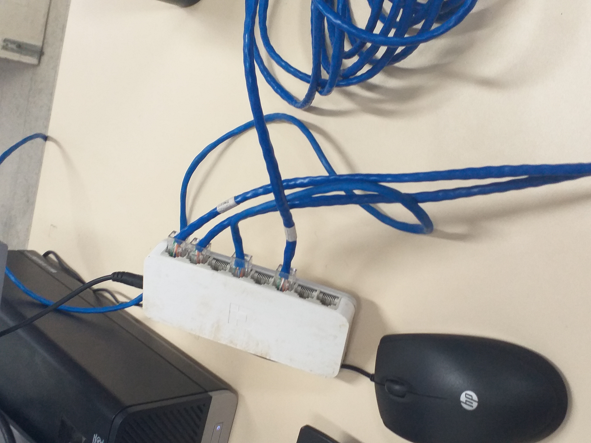

### 3.2. Modo Bridge

### 3.3. Testando a conectividade entre as VMs

   * Ping da VM1-PC1 para VM2-PC2

```shell
ping 192.168.13.22      # ctrl + c para finalizar o comando
```
   * Ping da VM1-PC1 para VM2-PC3

```shell
ping 192.168.13.23      
```

 * Ping da VM1-PC1 para VM2-PC4

```shell
ping 192.168.13.24     
```

* Ping das demais VMS para VM1-PC1

```shell
ping 192.168.13.17    
```

* Ping das demais VMS para VM2-PC1

```shell
ping 192.168.13.21    
```

* Fazer ping de todos para todos e verificar o funcionamento dos mesmos.

### 3.4. Resultados de pings

* De VM1-PC1 para VM1-PC4

<p><center> Figura 2: Ping VM1-PC1 para VM1-PC4</center></p>   
   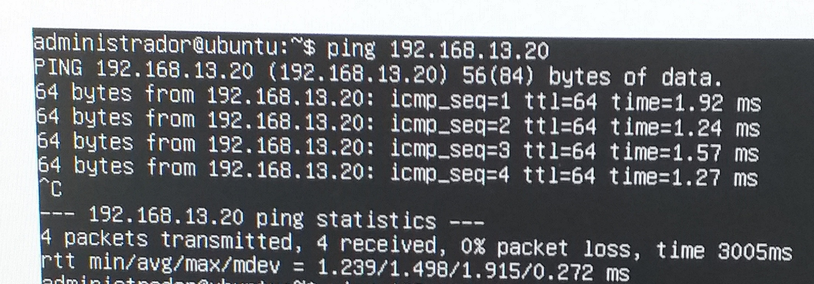
    
* De VM1-PC1 para VM2-PC1

<p><center> Figura 3: Ping VM2-PC1 para VM1-PC1</center></p>   
   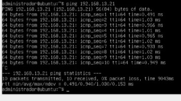
    
* De VM2-PC1 para VM1-PC1

<p><center> Figura 3: Ping VM2-PC1 para VM1-PC1</center></p>   
   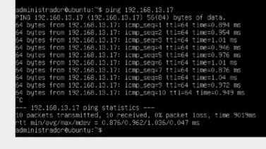
    
* De VM2-PC1 para VM1-PC2

<p><center> Figura 4: Ping VM2-PC1 para VM1-PC2</center></p>   
   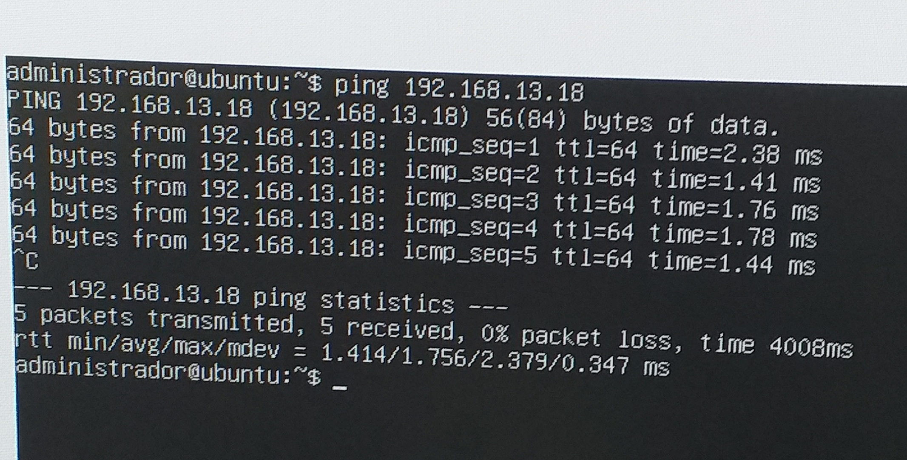
    
* De VM2-PC1 para VM2-PC2

<p><center> Figura 4: Ping VM2-PC1 para VM2-PC2</center></p>   
   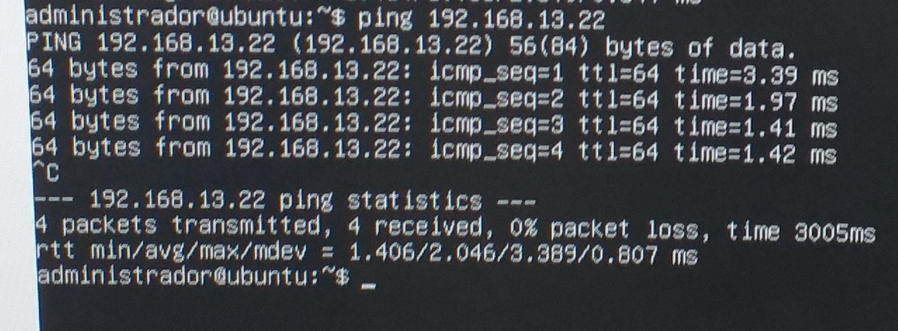
    
* De VM2-PC1 para VM1-PC3

<p><center> Figura 5: Ping VM2-PC1 para VM2-PC2</center></p>   
   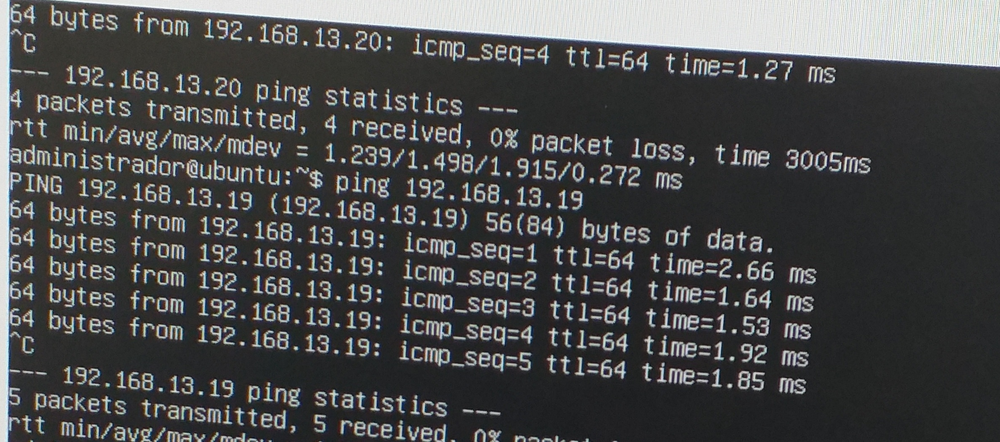
    
* De VM2-PC1 para VM2-PC3

<p><center> Figura 5: Ping VM2-PC1 para VM2-PC2</center></p>   
   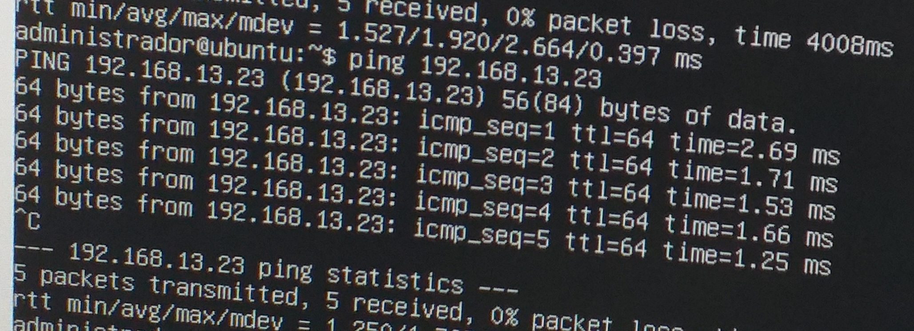
    
* De VM2-PC1 para VM1-PC4

<p><center> Figura 5: Ping VM2-PC1 para VM2-PC2</center></p>   
   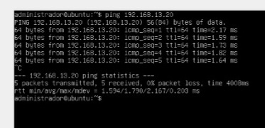

* De VM1-PC3 para VM2-PC3

<p><center> Figura 5: Ping VM2-PC1 para VM2-PC2</center></p>   
   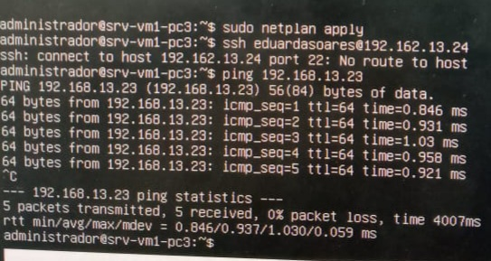   

* De VM2-PC1 para VM2-PC4

<p><center> Figura 5: Ping VM2-PC1 para VM2-PC2</center></p>   
   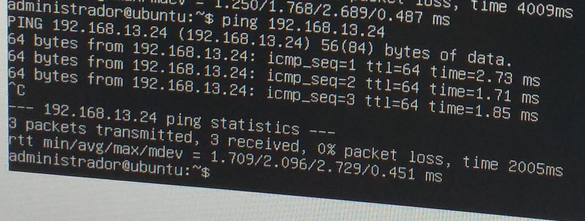
    
* De VM1-PC4 para VM2-PC4

<p><center> Figura 5: Ping VM2-PC1 para VM2-PC2</center></p>   
   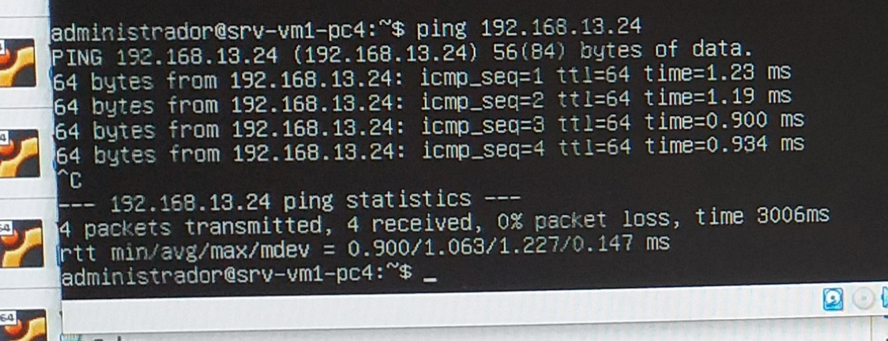
    
* De VM1-PC2 para usuário duda1 (VM1-PC4) e para usuário duda2 (VM2-PC4)

<p><center> Figura 5: Ping VM2-PC1 para VM2-PC2</center></p>   
   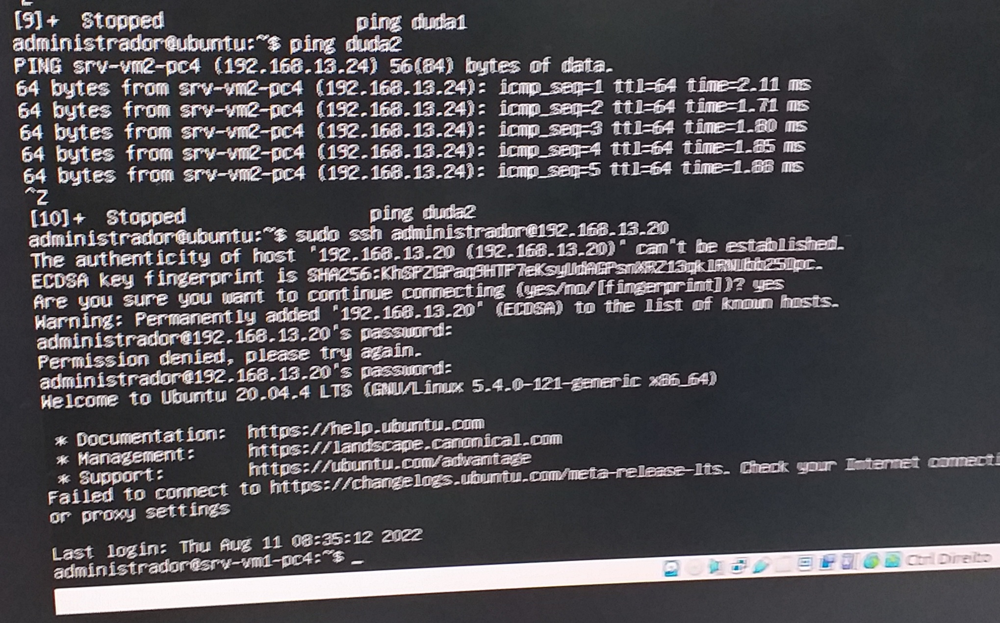
