## 4. Roteiro SSH

Agora que nossas VMs estão configuradas e os cabos estão conectados, vamos fazer o acesso remoto ssh entre as VMs, ou seja, conectar-se a um usuário de um pc a partir da VM de outro.

### 4.1. Atribuindo nomes aos servidores hostname

Antes de criar novos usuários, vamos alterar os nomes de hostname do usuário administrador (seguindo as definições denomes determinada na tabela da etapa 1). Logo, em cada VM executamos um comando no formato seguinte: 

```sudo hostnamectl set-hostname <hostname>```

### 4.1.1.  VM's  PC1

<p><center> Figura 1: Exemplo alteração de hostname PC1</center></p>   
   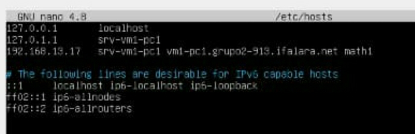

* VM1 PC1

```sudo hostnamectl set-hostname srv-vm1-pc1```

* VM2 PC1

```sudo hostnamectl set-hostname srv-vm2-pc1```
   
### 4.1.2.  VM's  PC2

<p><center> Figura 2: Exemplo alteração de hostname PC2</center></p>   
   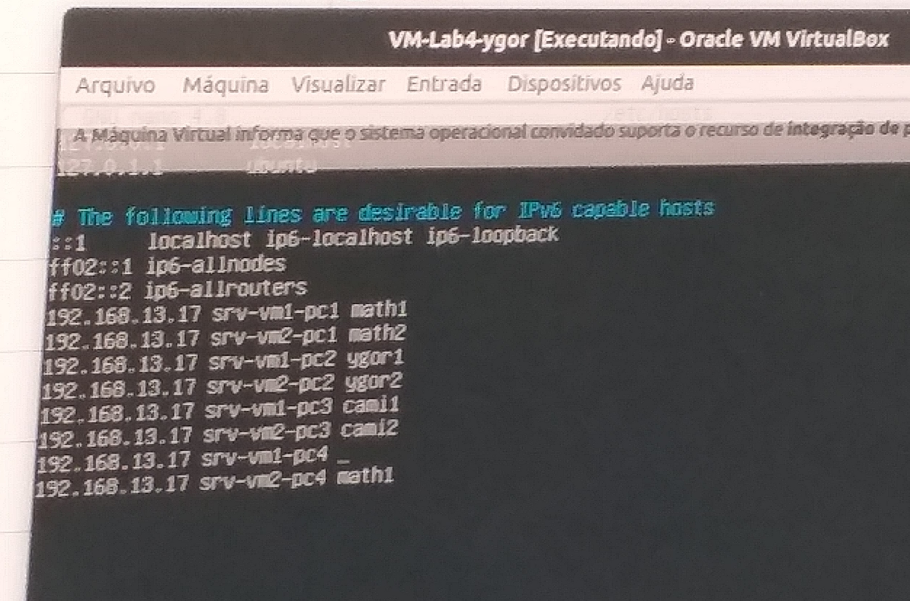

* VM1 PC2
 
```sudo hostnamectl set-hostname srv-vm1-pc2```

* VM2 PC2

```sudo hostnamectl set-hostname srv-vm2-pc2```

### 4.1.3.  VM's  PC3

<p><center> Figura 3: Exemplo alteração de hostname PC3</center></p>   
   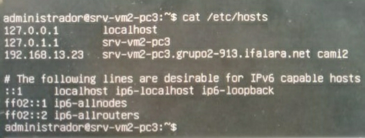

* VM1 PC3

```sudo hostnamectl set-hostname srv-vm1-pc3```

* VM2 PC3

```sudo hostnamectl set-hostname srv-vm2-pc3```

### 4.1.4.  VM's  PC4

<p><center> Figura 4: Exemplo alteração de hostname PC4</center></p>   
   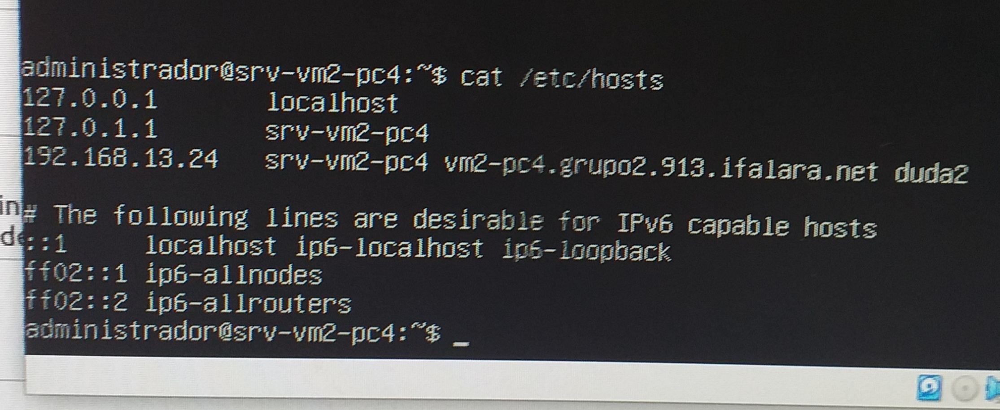

* VM1 PC4

```sudo hostnamectl set-hostname srv-vm1-pc4```

* VM2 PC4

```sudo hostnamectl set-hostname srv-vm1-pc4```

### 4.2. Instalar SSH

Para instalar o SSH antes de conectar os PCs para fazer a VM funcionar, é necessário que o cabeamento de conexão de rede ponto-a-ponto seja desfeito, ou seja, desconecta tais cabos do pc (deixando o cabo de conexão à internet em seu lugar).

Então, verificamos se a internet está funcionando utilizando os comandos seguintes:

```
sudo apt update
sudo apt upgrade -y
```

Se não ocorrer erros, pode prosseguir com a instalação.

Para instalar o SSH Server, utilizamos os comandos: 

```
sudo apt-get install openssh-server
```
Agora verificamos se o ssh está ativado com o comando:

``systemctl status ssh``

A figura a seguir demonstra o que deve aparecer após a execução do código anterior, caso ocorra tudo certo.

<p><center> Figura 5: Instalar ssh</center></p>   
   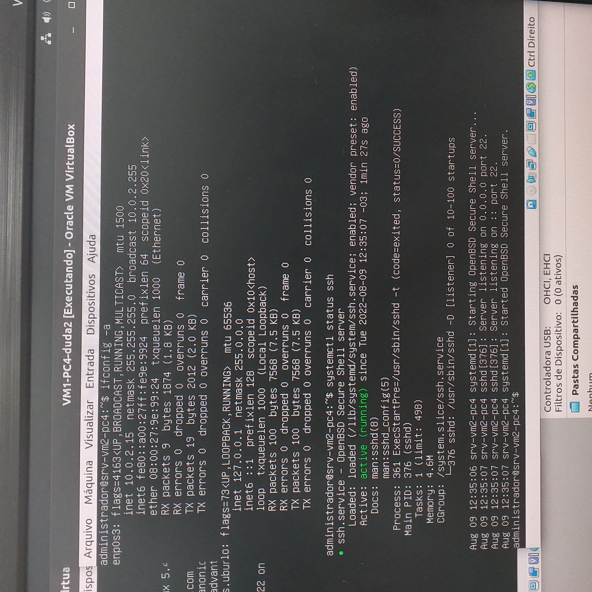

Feito isso, verificamos as portas do sistema através do comando:

``netstat -an | grep LISTEN.``

<p><center> Figura 6: Verificação de portas</center></p>   
   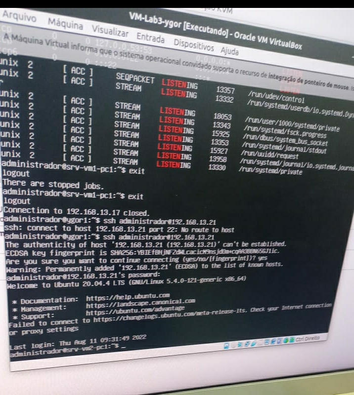

Agora, para certificarnos que o controle de acesso do sistema estão exercendo corretamente sua funcionalidade, o comando ```` deve ser inserido para ativar o SSH no firewell UFW.

Uma vez que ele isto for feito, as conexões SSH serão permitidas.

Logo, para que essas configurações sejam feitas, efetuamos:

```
sudo ufw allow ssh.
sudo ufw status
sudo ufw enable
```
<p><center> Figura 7: Instalar ssh</center></p>   
   
    
### 4.3. Criando usuários

Em cada VM crie um usuário com o comando ``adduser``

<p><center> Figura 5: Adição de usuário</center></p>   
   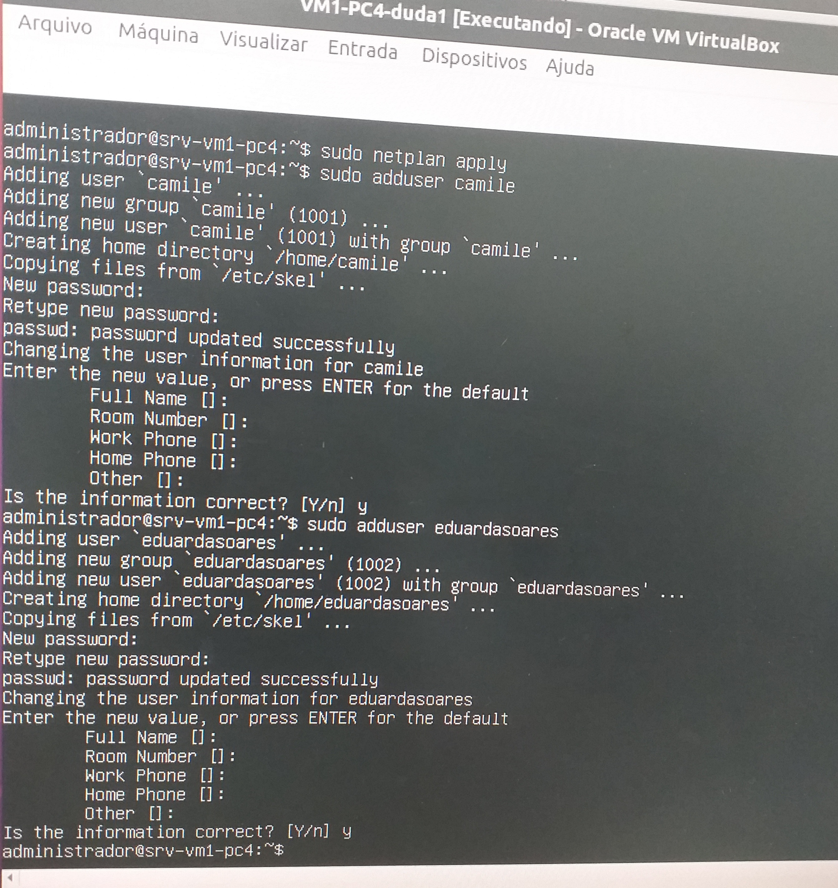

<p><center> Figura 5: Adição de usuário</center></p>   
   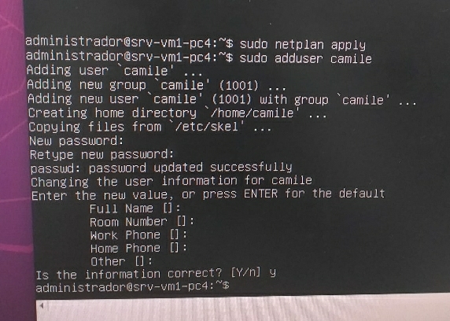
    
### 4.4. Acessando uma VM remotamente

* Exemplo: $ ssh ``<user>``@``<ipServidorRemoto>``

### 4.5. Fazendo o login 


* de: srv-vm2-pc1
   * para: srv-vm2-pc3

```shell
ssh camile@192.168.13.23
```

* de: srv-vm1-pc3
   * para: srv-vm2-pc4

```shell
ssh eduardasoares@192.168.13.24
```

* de: srv-vm1-pc3
   * para: srv-vm2-pc4
    
## 5. Roteiro Host-Only (SSH pelo terminal)

* Abrir opção ``Host Network Manager`` dentro da aba ``Arquivo`` do Virtualbox ou ``ctrl + H``
* Criar novo adaptador de rede no botão ``Criar``
* Click na botão ``Propriedades`` --> ``Servidor DHCP`` --> click ``[]Habilitar Servidor``
* Entre em uma VM e digite ``ifconfig -a`` (necessita do ``sudo apt install net-tools`` antes de ser usado)
* Verifique se na saída do comando há o nome do adaptador de rede que foi criado
* Desligue a VM com ``sudo poweroff``
* Click no botão ``configurações`` --> ``Rede``
* Habilite um novo adaptador de rede clickando em ``Adaptador <n>`` --> ``[] Habilitar placa de rede``

* Iniciar VM
* Digite ``ifconfig -a``
* Verifique se na saída do comando há o nome do adaptador de rede que foi criado
* Execute ``cd /etc/netplan/``
* ``sudo nano <nome_do_arquivo>.yaml``
   * Adicione no arquivo:
      ```
      <nome_adaptador_de_rede>:
         dhcp4: true
      ```
* Execute ``sudo netplan apply``
* Verifique no ``ifconfig -a`` se as mudanças deram certo
* Abrir terminal do pc (sem ser da vm)
* ``ssh <user>@<ip>``


<p><center> Figura 6: Adaptador novo ativado</center></p>   
   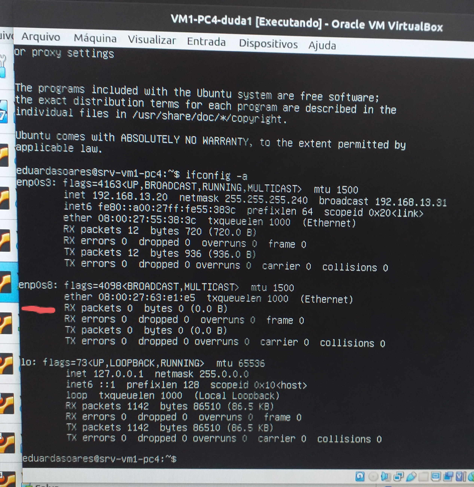

## 6. Testes de ssh

<p><center> Figura 7:  VM2-PC2 para srv-vm1-pc1</center></p>   
   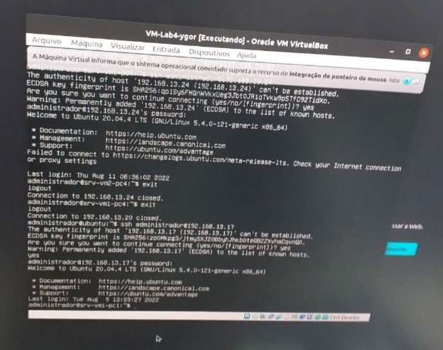

<p><center> Figura 8: VM2-PC1 para 192.168.13.18 (VM1-PC2)</center></p>   
   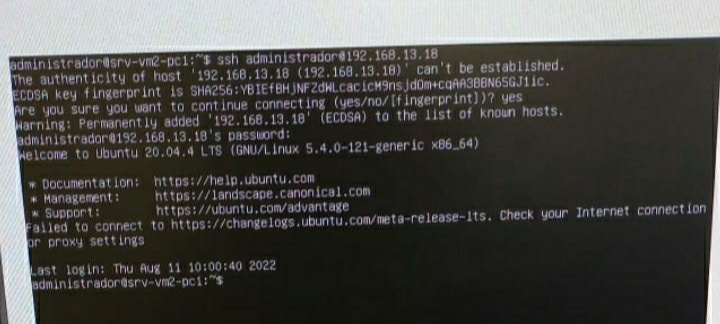
    
<p><center> Figura 9: VM2-PC2 para srv-vm2-pc4</center></p>   
   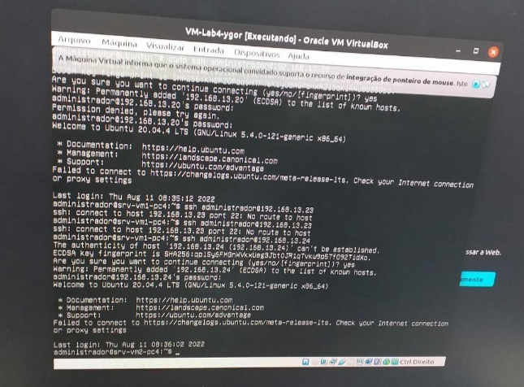
    
<p><center> Figura 10: VM2-PC1 para VM1-PC4</center></p>   
   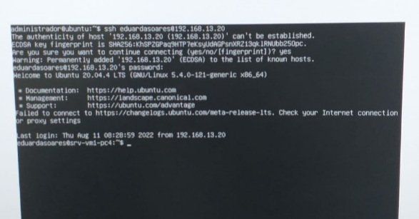
